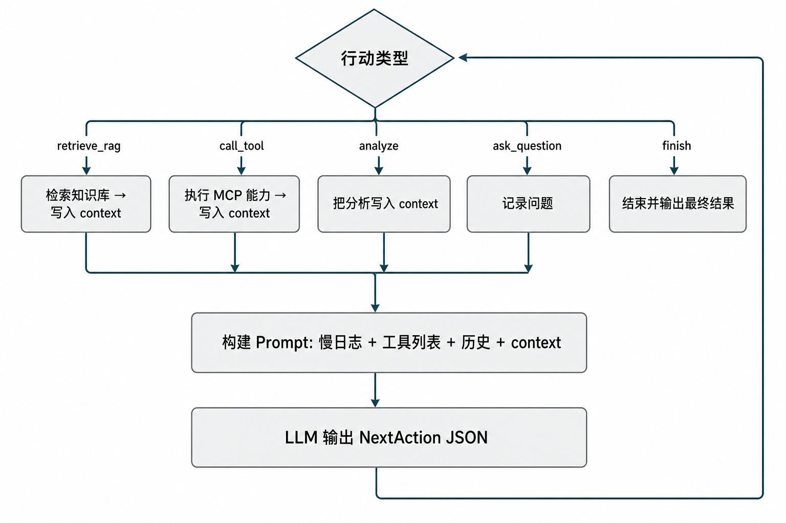

# slowlog-ai

基于 LLM 的 MySQL 慢日志智能分析（Go）。从 Prompt 约束、RAG、MCP 能力感知到 V6 Agent 多轮决策，**V1–V6 代码均保留在同一仓库**，便于对比演进。

| 文档 | 内容 |
|------|------|
| **本文 README** | 速查表、安装运行、目录 |
| [docs/VERSIONS.md](docs/VERSIONS.md) | V1–V6 **设计思路、代码示例、对比与学习要点** |
| [docs/ARCHITECTURE.md](docs/ARCHITECTURE.md) | 接口、Options、MCP、MySQL、知识库、扩展开发、JSON 输出 |

---

## 项目背景

云数据库慢日志人工分析成本高，且多数工具偏统计、缺少「原因 + 建议」的语义分析。本项目用 **DeepSeek + Prompt / RAG + MCP 能力 + Agent 循环** 做辅助分析（DBA / 平台侧 PoC）。

---

## 版本演进速查

> 各版「怎么实现的」见 [docs/VERSIONS.md](docs/VERSIONS.md)。

### 当前默认演示

| 项 | 说明 |
|----|------|
| 入口 | `cmd/slowlog-ai/main.go` |
| 默认 | **V6 Agent**（`call_tool` / `retrieve_rag` / `analyze` / `ask_question` / `finish`） |
| 可切换 | `main.go` 内取消注释：**V4** 能力列表、**V5** Tool Calling |
| V1–V3 | `analyzer.NewAnalyzer` + `WithPromptBuilder`，见 [ARCHITECTURE · 分析流程](docs/ARCHITECTURE.md#analysis-flow) |

### 演进路线

**V1 问模型** → **V2 JSON 约束** → **V3 + RAG** → **V4 能力感知** → **V5 Tool Calling** → **V6 Agent**

### 总览表（V1 → V6）

| 版本 | 一句话 | 相对上一版的核心优化 | 关键代码 |
|------|--------|----------------------|----------|
| **V1** | 直接问模型 | 零约束，验证可行性 | `prompt/slowlog/v1_basic.go` |
| **V2** | 约束别瞎猜 | JSON；confirmed / suspected；禁止假设 schema | `v2_strict.go` · `analyzer/slowlog.go` |
| **V3** | 注入专家知识 | RAG；知识不进 confirmed；无知识回退 V2 | `v3_rag.go` · `rag/slowlog/docs/` |
| **V4** | 系统能自我介绍 | `Capability` + Registry；MCP 基础 | `v4_capability.go` · `mcp/*` |
| **V5** | 协议级调工具 | DeepSeek Tool Calling；多轮 tool_calls | `v5_tool_calling.go` · `v5_intent.go` |
| **V6** | Agent 规划全链路 | 5 种行动；上下文 + 轨迹；普通 Chat 即可 | `v6_agent.go` · `v6_action.go` |

### 各版本解决的「上一版痛点」

| 升级 | 上一版痛点 | 本版怎么解决 |
|------|------------|--------------|
| V1→V2 | 输出乱、不可解析、编造表结构 | 严格规则 + 强制 JSON |
| V2→V3 | 只靠模型常识 | RAG 注入；知识边界 |
| V3→V4 | 能力写死在 Prompt | 能力注册表，动态扩展 |
| V4→V5 | 正文里「说要调工具」不可靠 | API 级 Tool Calling |
| V5→V6 | 只会调工具 | Agent：RAG / 分析 / 追问 / 结束 |

### V5 与 V6（易混）

| 维度 | V5 | V6 |
|------|----|----|
| 决策 | `tool_calls`（DeepSeek 协议） | `NextAction` JSON |
| 范围 | 主要是 MCP 工具 | 工具 + RAG + 分析 + 提问 + 结束 |
| LLM | `ToolCallingClient` | 普通 `LLMClient` |
| main | 注释块 | **默认运行** |

### V6 Agent 执行流程

默认演示（`make run`）走 `internal/analyzer/v6_agent.go` 中的循环：每轮 LLM 输出一个 `NextAction`，本地执行后把结果写入 `context`，再进入下一轮 Prompt。



（大图与 Mermaid 源码：[docs/diagrams/v6-agent-flow.md](docs/diagrams/v6-agent-flow.md)）

**一轮循环（固定三步）**

| 步骤 | 做什么 | 代码 |
|------|--------|------|
| ① | 拼 Prompt（慢日志 + 可用工具 + 对话历史 + `context`） | `BuildAgentPromptV6` |
| ② | LLM 返回 `NextAction` JSON | `v6_agent.Analyze` → `llm.Chat` |
| ③ | 按 `type` 执行行动（见下表） | `switch decision.NextAction.Type` |

**`NextAction.type` 分支**

| type | 行为 | 下一轮 |
|------|------|--------|
| `retrieve_rag` | 按 `rag_query` 检索知识库，写入 `context` | 回到 ① |
| `call_tool` | 调用 MCP（如 `analyze_slow_log`、`explain_mysql_query`） | 回到 ① |
| `analyze` | 把中间分析写入 `context` | 回到 ① |
| `ask_question` | 记录问题（演示模式不阻塞等待用户） | 回到 ① |
| `finish` | 输出 `result` 作为最终结果 | **结束** |

要看**每一轮**的决策与工具/RAG 明细：`SLOWLOG_AGENT_TRACE=1 go run ./cmd/slowlog-ai -agent-trace`，或见 [Agent 轨迹](#agent-轨迹观察每轮决策)。

### MCP 能力

| 能力名 | 作用 |
|--------|------|
| `analyze_slow_log` | 慢日志结构化分析 |
| `connect_mysql_instance` | 校验 `.env` 中 MySQL（可选） |
| `explain_mysql_query` | 对 SELECT 执行 EXPLAIN（如 `test.products`） |
| `add_mysql_index` | 生成/执行建索引 DDL（默认 `dry_run=true`） |

详见 [ARCHITECTURE · MCP](docs/ARCHITECTURE.md#mcp)。

### 如何体验某一版本

```bash
cp .env.example .env   # DEEPSEEK_API_KEY；可选 MYSQL_*
make run               # 默认 V6
make mysql-check       # 仅 MySQL，不跑 LLM
```

切换 V4/V5：编辑 `cmd/slowlog-ai/main.go` 对应注释块。V1–V3 见 [docs/VERSIONS.md](docs/VERSIONS.md)。

---

## 项目结构

```
slowlog-ai/
├── cmd/slowlog-ai/main.go    # 默认 V6；V4/V5 注释块可开
├── cmd/mysql-check/          # MySQL 连通性
├── internal/
│   ├── analyzer/             # V1–V3 / V5 / V6
│   ├── prompt/slowlog/       # v1_basic … v6_action
│   ├── mcp/                  # Capability 与 Server
│   ├── config/ · mysql/      # 本地 MySQL
│   ├── llm/ · rag/
├── docs/                      # VERSIONS、ARCHITECTURE、diagrams/
├── Makefile · .env.example
```

---

## 快速开始

**环境**：Go 1.23+ · DeepSeek API Key

### Agent 轨迹（观察每轮决策）

```bash
git clone <repository-url>
cd slowlog-ai
cp .env.example .env
# 编辑 .env：DEEPSEEK_API_KEY=... ；可选 MYSQL_*

make deps    # 内网 GOPROXY 超时时：默认 goproxy.cn
make run     # V6 演示
go run ./cmd/slowlog-ai /path/to/slowlog.txt

# 观察 Agent 每轮决策 / 工具 / RAG（轨迹 stderr，汇总 stdout）
SLOWLOG_AGENT_TRACE=1 go run ./cmd/slowlog-ai -agent-trace
```

**V1–V3 代码示例**（RAG + v3）：[ARCHITECTURE · V1–V3 集成示例](docs/ARCHITECTURE.md#v1-v3-example)

**构建**：

```bash
make build   # 依赖 vendor，见 Makefile
make doc-links   # 校验 README / docs 内 Markdown 链接与标题锚点（GoLand 规则）
```

---

## 贡献与许可

欢迎 Issue / PR。许可证：[待定]
