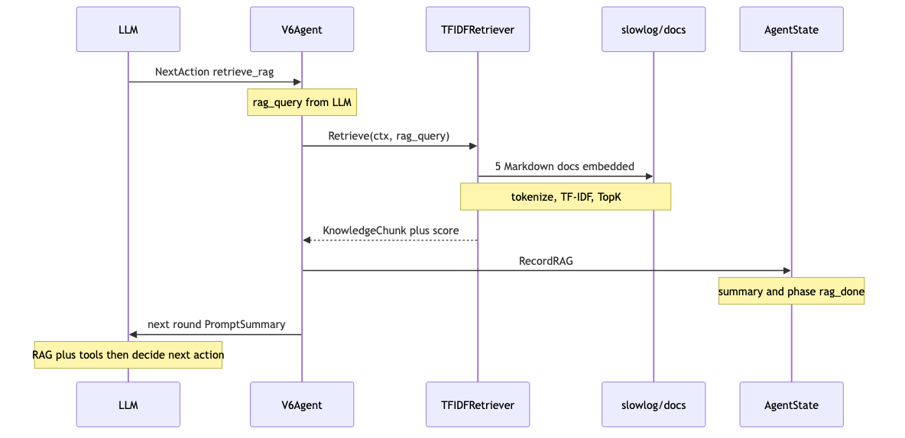
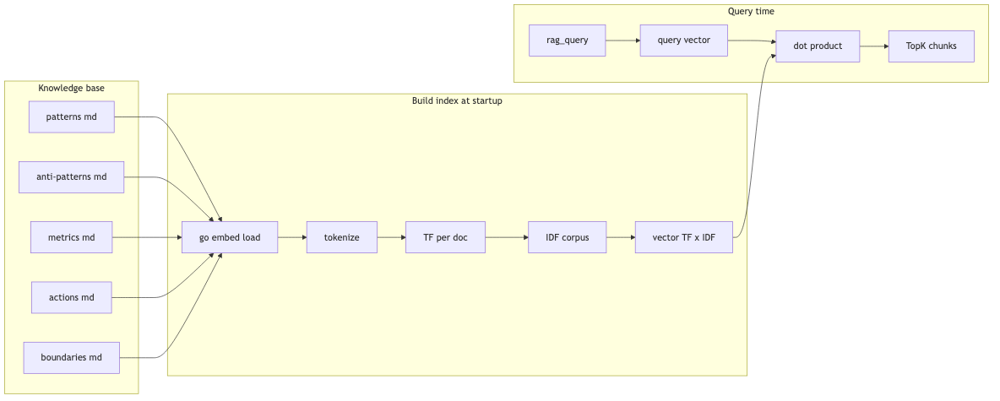
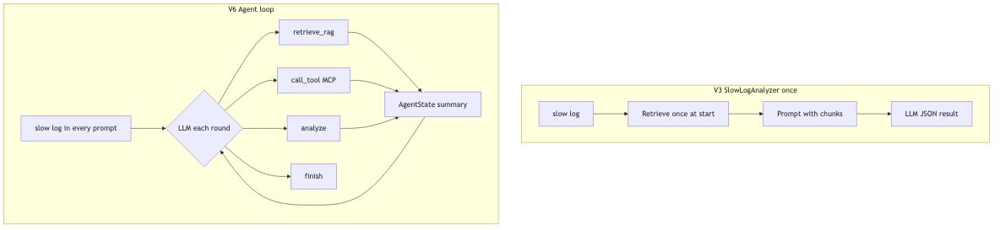
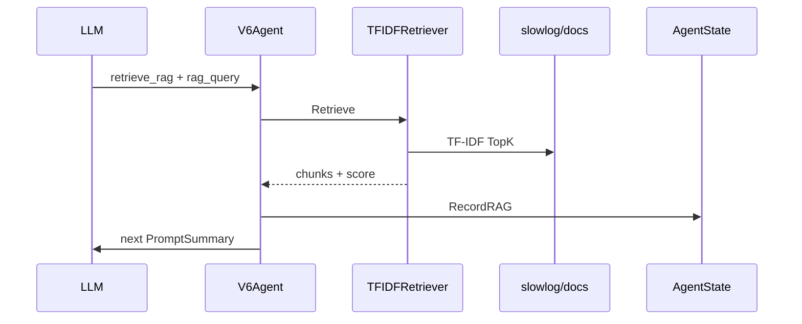

# RAG 检索流程与 V3 / V6 对比

← [路线图](../AGENT-ROADMAP.md) · [架构 · RAG](../ARCHITECTURE.md) · [VERSIONS · V3/V6](../VERSIONS.md)

> 实现：`internal/rag/` · **用法**：[RAG.md](../RAG.md) · 验证：`make rag-check` · 重生成图片：`make doc-diagrams`

---

## 1. 真 RAG：从 `rag_query` 到下一轮 Prompt

V6 里 LLM 输出 `retrieve_rag` + `rag_query` 之后，本地检索与注入路径如下。



**和 Mock 的差别**：`TFIDFRetriever` 会根据 `rag_query` **排序**；Mock 永远 2 条固定文案，与 query 无关。

---

## 2. TF-IDF 索引（启动时一次建好）



| 步骤 | 代码 |
|------|------|
| 嵌入知识库 | `docs_embed.go` |
| 分词 | `tokenize.go` |
| 建索引 / 检索 | `tfidf.go` |
| 默认实现 | `factory.go` → `NewDefaultRetriever()` |

---

## 3. V3 vs V6：RAG 在链路中的位置



| 对比项 | V3 | V6 |
|--------|----|----|
| **何时检索** | Analyze 开头，通常 **1 次** | LLM 可多轮 `retrieve_rag` |
| **查询谁定** | Prompt 构建逻辑 / 固定策略 | **LLM 每轮给 `rag_query`** |
| **知识怎么进模型** | 直接拼进 **当次** Prompt | 先进 **AgentState 摘要**，再进下一轮 Prompt |
| **与工具顺序** | RAG 与 MCP **分离**（不同版本/入口） | 可先 RAG → 连库 → EXPLAIN（guided） |
| **检索实现** | 同一 `rag.Retriever` 接口 | 同上；默认 **TF-IDF**，eval 用 Mock |

---

## 4. 和「向量 RAG」的演进关系

```text
已实现                    可演进
─────────────────────────────────────────
按 ## 切 chunk            更长文档按长度二次切分
TF-IDF（默认）            向量库持久化（Qdrant / sqlite-vec）
embedding + 内存 TopK     HTTP Embedding（SLOWLOG_EMBEDDING_PROVIDER=http）
rag.Retriever 接口        实现不变，替换后端即可
```

汇报时可强调：**Agent 侧协议（retrieve_rag、AgentState、摘要）已稳定**，检索后端可从 TF-IDF 换成向量而不改 V6 循环。

---

## 5. 怎么用（命令 + 环境变量）

详见 **[docs/RAG.md](../RAG.md)**。速查：

| 目的 | 做法 |
|------|------|
| 默认跑 Agent | 不设变量 → **TF-IDF** + 按 `##` 切 chunk |
| 只测检索 | `make rag-check` 或 `make rag-check "你的查询词"` |
| 对比两种后端 | `make rag-check-compare` |
| 试向量（不调 API） | `SLOWLOG_RAG=embedding` + `SLOWLOG_EMBEDDING_PROVIDER=local`（默认） |
| 试真 Embedding API | `SLOWLOG_RAG=embedding` + `SLOWLOG_EMBEDDING_PROVIDER=http` + Key |
| 回归测试 | `SLOWLOG_RAG=mock make agent-eval` |

```bash
make rag-check
make rag-check-compare
make rag-check "LIMIT ORDER BY filesort 索引"
SLOWLOG_RAG=embedding make rag-check
SLOWLOG_RAG=embedding SLOWLOG_EMBEDDING_PROVIDER=http make rag-check   # 需 Key
make agent-run
SLOWLOG_RAG=mock make agent-eval
```

---

## Mermaid 源码（可选，GitHub 可渲染）

改图时编辑 `*.mmd` 后执行 `make doc-diagrams`。

<details>
<summary>展开 Mermaid 源码</summary>

### 时序图 `rag-query-sequence.mmd`



### 索引图 `rag-tfidf-index.mmd`

见仓库内 [rag-tfidf-index.mmd](./rag-tfidf-index.mmd)。

### 对比图 `rag-v3-v6-compare.mmd`

见仓库内 [rag-v3-v6-compare.mmd](./rag-v3-v6-compare.mmd)。

</details>
