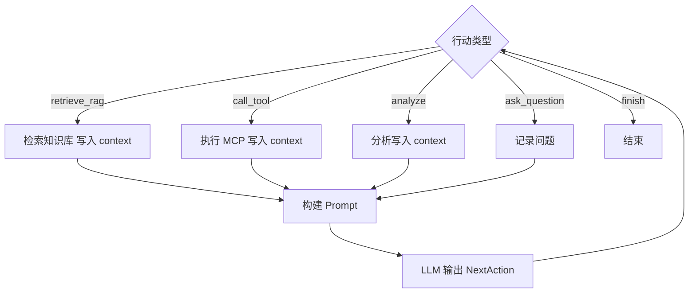

# V6 Agent 流程图

← [README · V6 Agent 执行流程](../../README.md#v6-agent-执行流程)

**说明**：决策在顶部「行动类型」；四条分支写入 `context` 后汇总为「构建 Prompt」，再经 LLM 输出 `NextAction` 回到下一轮。`finish` 分支结束循环（图中右侧）。

可选 Mermaid 源码（GitHub 可渲染）：

